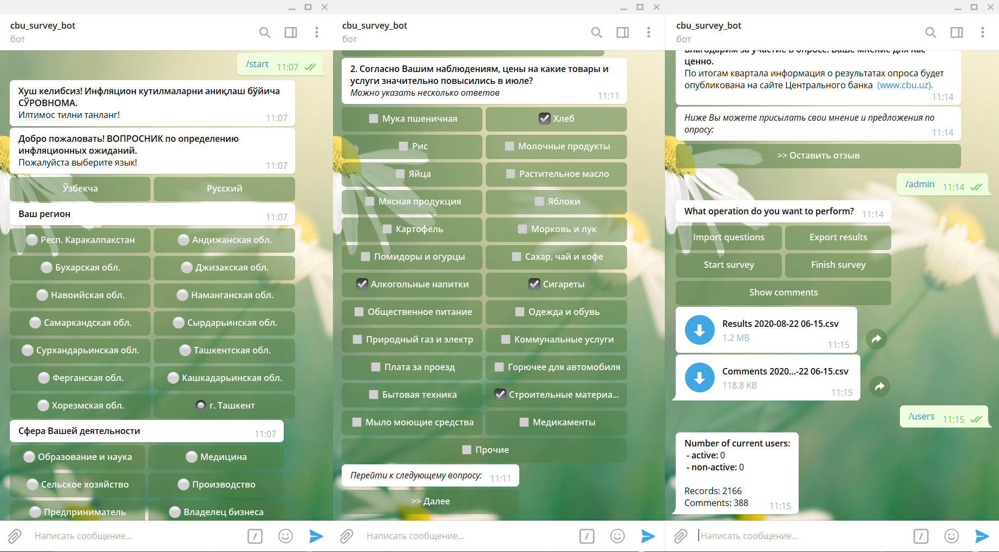

# survey_bot
Telegram bot for monthly Inflation expectations surveys of CBU.
Access by https://t.me/cbu_survey_bot

#### Example of interface

This repository contains a robust Python-based bot designed for conducting surveys via Telegram. The bot is built to handle multi-question surveys with bilingual support (Uzbek and Russian), collect user responses, manage data, and generate insightful reports.

## Key Features:
- **Dynamic Survey Management:**
  - Supports importing survey questions from Excel files.
  - Allows customization of questions, options, and layouts.
  - Facilitates surveys with single or multiple-choice questions.

- **Telegram Bot Integration:**
  - Built using the `python-telegram-bot` library.
  - Supports interactive surveys through inline buttons.
  - Provides admin controls for managing surveys.

- **Bilingual Support:**
  - Supports Uzbek and Russian languages.
  - Displays survey questions, responses, and instructions in the user's chosen language.

- **Data Storage and Processing:**
  - Stores responses in a MySQL database.
  - Processes and exports survey results to CSV files.
  - Tracks active and inactive users during the survey.

- **Comment Collection:**
  - Allows users to leave feedback after completing the survey.
  - Stores feedback in the database for review.

- **Admin Features:**
  - Import and export survey questions.
  - Start, stop, or override running surveys.
  - Monitor user activity and export results.

## Workflow:
1. **Survey Setup:**
   - Admin imports questions from an Excel file or database.
   - Bot prepares questions for interaction.

2. **Survey Execution:**
   - Users start the survey via Telegram.
   - Bot guides users through the survey, question by question.
   - Responses are stored in real-time.

3. **Feedback Collection:**
   - After completing the survey, users can provide additional comments or feedback.

4. **Data Export:**
   - Admin exports responses and comments for analysis.

## Technology Stack:
- **Backend:**
  - Python with `python-telegram-bot` library for bot functionality.
  - MySQL database for data storage and retrieval.

- **Data Processing:**
  - Pandas for handling data transformations.
  - CSV and Excel integration for importing and exporting survey data.

## Usage:
1. Clone the repository and configure the environment.
2. Set up the Telegram bot token and database credentials.
3. Run the bot to start managing surveys and collecting responses.

## Example Use Cases:
- Collecting inflation expectations for economic research.
- Conducting customer satisfaction surveys.
- Gathering feedback for events or services.

Developed by **Shakhzod**, this tool provides a seamless and efficient way to conduct surveys and collect feedback via Telegram, tailored to handle multilingual surveys and large-scale responses. 

---

Let me know if you'd like to refine or add more details!
